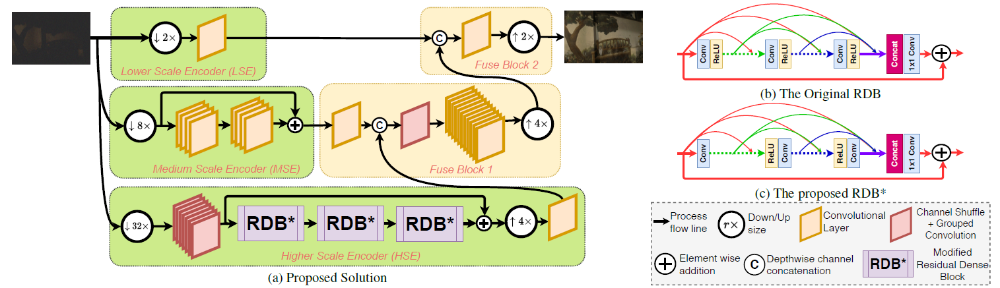
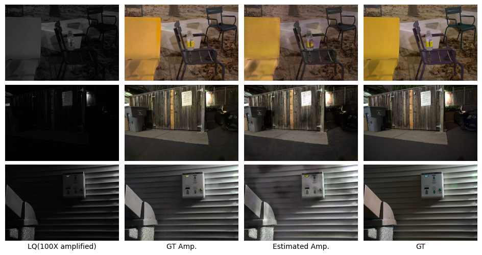

# Restoring Extremely Dark Images in Real Time

A PyTorch implementation of *[CVPR 2021 paper](https://openaccess.thecvf.com/content/CVPR2021/html/Lamba_Restoring_Extremely_Dark_Images_in_Real_Time_CVPR_2021_paper.html), "Restoring Extremely Dark Images in Real Time"*



## Requiremnets

- PyTorch
- torchvision
- requirements.txt

Please note that **Python>=3.6 is required** since I used f-strings.

## Dataset Preparation

The model is trained on the [SID Sony dataset](https://github.com/cchen156/Learning-to-See-in-the-Dark). To prepare dataset, please specify `data_dir` in [config.toml](config.toml) and organize the dataset to the following structure:

```bash
    ${data_dir}
    ├── short
    │   ├──00001_00_0.04s.ARW
    │   ├──00001_00_0.1s.ARW
    │   ├── ...
    ├── long
    │   ├──00001_00_0.04s.ARW
    │   ├──00001_00_0.1s.ARW
    │   ├── ...
```

## Training

To train the model, run:

```bash
python train.py config.toml
```

## Testing

The test a pretrained model, run:

```bash
python test.py config.toml ${MODEL_PATH}
```

A pretrained model on the SID Sony dataset is provided under `pretrained/`.

## Results


